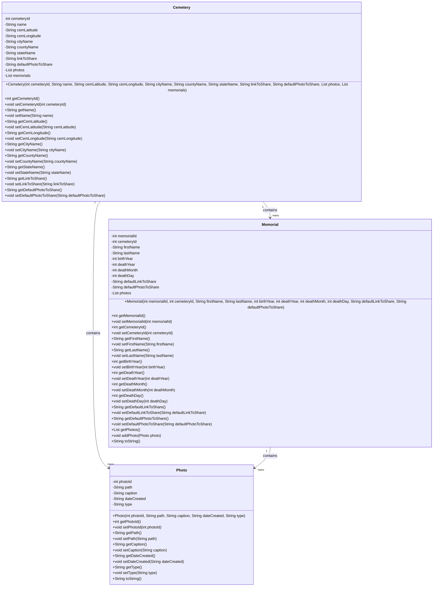

# GraveFinder

This application pulls cemetery, memorial and photo data out of FindAGrave and exports the data to a csv file.

## Class Diagram for Cemetery, Memorial, Photo classes

## Development Environment Setup

1.  Java
    - Ensure Java is setup correctly by typing the following in the console
    - Java -version
2.  Maven
    - Install the latest Maven from https://maven.apache.org/download.cgi
    - Download the Binary zip archive
    - For this app it is version apache-maven-3.9.8-bin.zip
    - Extract the zip to C:\Program Files\Maven
    - Setup Environment Variables
    - Set the **MAVEN_HOME** environment variable:
      - Open the Start Menu and search for Environment Variables.
      - Click on Edit the system environment variables.
      - In the System Properties window, click on Environment Variables.
      - Under System variables, click New and add:
      - Variable name: MAVEN_HOME
      - Variable value: C:\Program Files\Apache\Maven\apache-maven-3.9.8 (adjust the path based on your extraction location and Maven version).
    - Add Maven to the Path
      - In the System variables section, find the Path variable and click Edit.
      - Click New and add the path to the Maven bin directory:
      - C:\Program Files\Apache\Maven\apache-maven-3.9.8\bin
    - Verify installation
      - Open a new Command Prompt and type:
        - mvn -version
      - You should see Maven version information, confirming the installation was successful.
3.  JavaFX
    - Get the latest JavaFX SDK from https://gluonhq.com/products/javafx/
    - This app is using 22.0.2
    - Extract zip file to C:\Program Files\JavaFX\javafx-sdk-22.0.2
    - Make sure you have it setup correct in your pom.xml file
4.  Selenium Setup
    - Find Selenium in the Maven repository
    - This app is using version 4.23.0
    - Copy the dependency into the pom.xml file
5.  Web Driver setup
    - Edge
      - Browser version: Version 127.0.2651.74 (Official build) (64-bit)
      - Download Edge Web driver at Microsoft Edge WebDriver | Microsoft Edge Developer
      - Used same driver as Edge version
      - Add the path of the Edge driver to the system path
    - Chrome
      - Browser version: Version 127.0.6533.89 (Official Build) (64-bit)
      - Downloaded driver https://storage.googleapis.com/chrome-for-testing-public/127.0.6533.88/win64/chromedriver-win64.zip
      - Add the path of the Chrome driver to the system path
