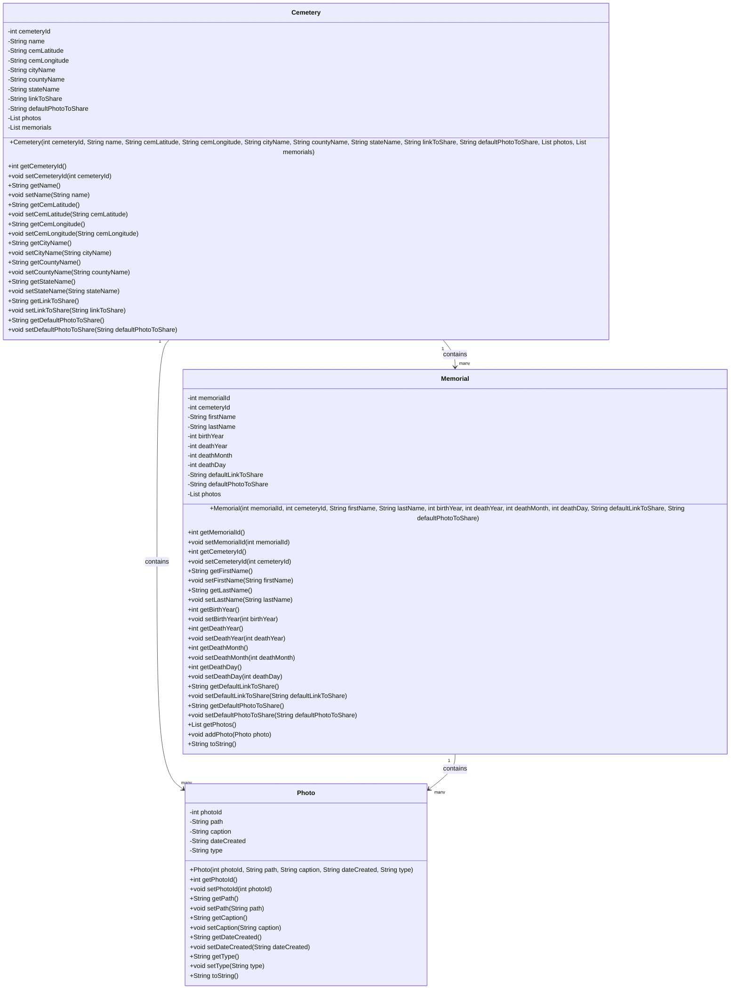

```mermaid
classDiagram
    class Cemetery {
        -int cemeteryId
        -String name
        -String cemLatitude
        -String cemLongitude
        -String cityName
        -String countyName
        -String stateName
        -String linkToShare
        -String defaultPhotoToShare
        -List<Photo> photos
        -List<Memorial> memorials
        +Cemetery(int cemeteryId, String name, String cemLatitude, String cemLongitude, String cityName, String countyName, String stateName, String linkToShare, String defaultPhotoToShare, List<Photo> photos, List<Memorial> memorials)
        +int getCemeteryId()
        +void setCemeteryId(int cemeteryId)
        +String getName()
        +void setName(String name)
        +String getCemLatitude()
        +void setCemLatitude(String cemLatitude)
        +String getCemLongitude()
        +void setCemLongitude(String cemLongitude)
        +String getCityName()
        +void setCityName(String cityName)
        +String getCountyName()
        +void setCountyName(String countyName)
        +String getStateName()
        +void setStateName(String stateName)
        +String getLinkToShare()
        +void setLinkToShare(String linkToShare)
        +String getDefaultPhotoToShare()
        +void setDefaultPhotoToShare(String defaultPhotoToShare)
    }

    class Memorial {
        -int memorialId
        -int cemeteryId
        -String firstName
        -String lastName
        -int birthYear
        -int deathYear
        -int deathMonth
        -int deathDay
        -String defaultLinkToShare
        -String defaultPhotoToShare
        -List<Photo> photos
        +Memorial(int memorialId, int cemeteryId, String firstName, String lastName, int birthYear, int deathYear, int deathMonth, int deathDay, String defaultLinkToShare, String defaultPhotoToShare)
        +int getMemorialId()
        +void setMemorialId(int memorialId)
        +int getCemeteryId()
        +void setCemeteryId(int cemeteryId)
        +String getFirstName()
        +void setFirstName(String firstName)
        +String getLastName()
        +void setLastName(String lastName)
        +int getBirthYear()
        +void setBirthYear(int birthYear)
        +int getDeathYear()
        +void setDeathYear(int deathYear)
        +int getDeathMonth()
        +void setDeathMonth(int deathMonth)
        +int getDeathDay()
        +void setDeathDay(int deathDay)
        +String getDefaultLinkToShare()
        +void setDefaultLinkToShare(String defaultLinkToShare)
        +String getDefaultPhotoToShare()
        +void setDefaultPhotoToShare(String defaultPhotoToShare)
        +List<Photo> getPhotos()
        +void addPhoto(Photo photo)
        +String toString()
    }

    class Photo {
        -int photoId
        -String path
        -String caption
        -String dateCreated
        -String type
        +Photo(int photoId, String path, String caption, String dateCreated, String type)
        +int getPhotoId()
        +void setPhotoId(int photoId)
        +String getPath()
        +void setPath(String path)
        +String getCaption()
        +void setCaption(String caption)
        +String getDateCreated()
        +void setDateCreated(String dateCreated)
        +String getType()
        +void setType(String type)
        +String toString()
    }

    Cemetery "1" --> "many" Memorial : contains
    Cemetery "1" --> "many" Photo : contains
    Memorial "1" --> "many" Photo : contains
```
